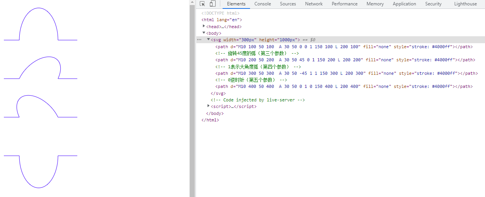

# svg梳理

## 1. svg简介

SVG 是可缩放矢量图形（Scalable Vector Graphics）的简称，是一种基于 XML 的图像格式，用于描述二维矢量图形。SVG 图像可以通过文本编辑器创建和编辑，也可以使用图形编辑器进行设计和修改。

SVG 图像具有以下特点：

- 可缩放：SVG 图像可以无限放大或缩小，而不会失去清晰度。
- 矢量图形：SVG 图像由矢量图形组成，可以精确地描述图形的形状和颜色。与位图图像不同，SVG 图像不会因为放大而变得模糊。
- 丰富的图形元素：SVG 支持多种图形元素，如矩形、圆形、椭圆、多边形、路径等，以及文本和图像等。
- 交互性：SVG 图像可以包含交互式元素，如链接、动画和脚本等。
- 跨平台：SVG 图像可以在各种设备和浏览器上显示，包括桌面、移动设备和网络浏览器。
- 开放标准：SVG 是一个开放标准，由 W3C（万维网联盟）制定和维护。
- 支持滤镜和动画：SVG 支持滤镜和动画效果，可以创建复杂的视觉效果。
- 支持 CSS 和 JavaScript：SVG 图像可以使用 CSS 和 JavaScript 进行样式和交互控制。
- 支持嵌入到 HTML 中：SVG 图像可以直接嵌入到 HTML 文档中，也可以作为独立的文件使用。
- 支持网络字体：SVG 支持网络字体，可以显示自定义字体。
- 支持嵌入到 PDF 和其他文档中：SVG 图像可以嵌入到 PDF 和其他文档中，用于打印和发布。
- 支持导出为多种格式：SVG 图像可以导出为多种格式，如 PNG、JPEG、PDF 等。

## 2. svg基本语法

```html
<svg width="300" height="300">
  <circle cx="100" cy="100" r="100" stroke="black" stroke-width="3" fill="red" />
</svg>
```

如上所示，svg标签是根元素，width和height属性定义了svg画布的大小，circle标签定义了一个圆形，cx和cy属性定义了圆形的中心点坐标，r属性定义了圆形的半径，stroke和stroke-width属性定义了圆形的边框颜色和宽度，fill属性定义了圆形的填充颜色。

代码如下：

```html
<!DOCTYPE html>
<html lang="en">

  <head>
    <meta charset="UTF-8">
    <meta name="viewport" content="width=device-width, initial-scale=1.0">
    <title>svg语法</title>
  </head>

  <body>
    <svg width="300" height="300">
      <circle cx="100" cy="100" r="100" stroke="black" stroke-width="3" fill="red" />
    </svg>
  </body>

</html>
```

效果如下：


## 3. svg属性

svg标签的常用属性：

- width：定义svg画布的宽度。
- height：定义svg画布的高度。
- viewBox：定义svg画布的视口，即画布上可见的区域。viewBox属性接受四个值，分别是x、y、width和height，分别表示视口的左上角坐标和宽高。例如，viewBox="0 0 100 100"表示视口从(0,0)开始，宽高为100。
- preserveAspectRatio：定义svg画布的缩放方式。preserveAspectRatio属性接受两个值，分别是meet和slice。meet表示保持宽高比缩放，slice表示保持宽高比裁剪。
- xmlns：定义svg的命名空间，默认值为"http://www.w3.org/2000/svg"。
- xmlns:xlink：定义svg的xlink命名空间，默认值为"http://www.w3.org/1999/xlink"。
- version：定义svg的版本号，默认值为"1.1"。
- baseProfile：定义svg的基线配置文件，默认值为"full"。

### 3.1. weight和height属性

width和height属性定义了svg画布的大小，单位可以是像素（px）、百分比（%）或视口单位（vw、vh）。

```html
<svg width="300" height="300">
  <circle cx="100" cy="100" r="100" stroke="black" stroke-width="3" fill="red" />
</svg>
```

效果如下：


注意：width和height属性定义了svg画布的大小，但是svg画布的实际大小仍然由viewBox属性定义。如果viewBox属性的宽高与width和height属性的宽高不一致，那么svg画布会被缩放以适应viewBox属性。

### 3.2. viewBox属性

viewBox属性定义了svg画布的视口，即画布上可见的区域。viewBox属性接受四个值，分别是x、y、width和height，分别表示视口的左上角坐标和宽高。例如，viewBox="0 0 100 100"表示视口从(0,0)开始，宽高为100。

```html
<svg width="300" height="300" viewBox="0 0 100 100">
  <circle cx="100" cy="100" r="100" stroke="black" stroke-width="3" fill="red" />
</svg>
```

注意：viewBox属性定义了svg画布的视口，但是svg画布的实际大小仍然由width和height属性定义。如果viewBox属性的宽高与width和height属性的宽高不一致，那么svg画布会被缩放以适应视口。

### 3.3. preserveAspectRatio属性

preserveAspectRatio属性定义了svg画布的缩放方式。preserveAspectRatio属性接受两个值，分别是meet和slice。meet表示保持宽高比缩放，slice表示保持宽高比裁剪。

```html
<svg width="300" height="300" viewBox="0 0 100 100" preserveAspectRatio="meet">
  <circle cx="100" cy="100" r="100" stroke="black" stroke-width="3" fill="red" />
</svg>
```

### 3.4. xmlns和xmlns:xlink属性

xmlns和xmlns:xlink属性定义了svg的命名空间，默认值为"http://www.w3.org/2000/svg"和"http://www.w3.org/1999/xlink"。

```html
<svg xmlns="http://www.w3.org/2000/svg" xmlns:xlink="http://www.w3.org/1999/xlink" width="300" height="300" viewBox="0 0 100 100" preserveAspectRatio="meet">
  <circle cx="100" cy="100" r="100" stroke="black" stroke-width="3" fill="red" />
</svg>
```

### 3.5. version和baseProfile属性

version和baseProfile属性定义了svg的版本号和基线配置文件，默认值为"1.1"和"full"。

```html
<svg xmlns="http://www.w3.org/2000/svg" xmlns:xlink="http://www.w3.org/1999/xlink" width="300" height="300" viewBox="0 0 100 100" preserveAspectRatio="meet" version="1.1" baseProfile="full">
  <circle cx="100" cy="100" r="100" stroke="black" stroke-width="3" fill="red" />
</svg>
```

## 4. svg图形元素

svg图形元素包括：矩形、圆形、椭圆、线、折线、多边形、路径等。

### 4.1. 矩形 rect

矩形元素使用`<rect>`标签定义，常用属性包括：x、y、width、height、rx、ry、fill、stroke、stroke-width等。

- x：定义矩形的左上角x坐标。
- y：定义矩形的左上角y坐标。
- width：定义矩形的宽度。
- height：定义矩形的高度。
- rx：定义矩形的圆角x半径。
- ry：定义矩形的圆角y半径。
- fill：定义矩形的填充颜色。
- stroke：定义矩形的边框颜色。
- stroke-width：定义矩形的边框宽度。

代码如下：

```html
<svg width="300" height="300">
  <rect x="50" y="50" width="200" height="100" rx="10" ry="10" fill="red" stroke="black" stroke-width="3" />
</svg>
```

效果如下：


### 4.2. 圆形 circle

圆形元素使用`<circle>`标签定义，常用属性包括：cx、cy、r、fill、stroke、stroke-width等。

- cx：定义圆形的圆心x坐标。
- cy：定义圆形的圆心y坐标。
- r：定义圆形的半径。
- fill：定义圆形的填充颜色。
- stroke：定义圆形的边框颜色。
- stroke-width：定义圆形的边框宽度。

代码如下：

```html
<svg width="300" height="300">
  <circle cx="100" cy="100" r="100" stroke="black" stroke-width="3" fill="red" />
</svg>
```

效果如下：


### 4.3. 椭圆 ellipse

椭圆元素使用`<ellipse>`标签定义，常用属性包括：cx、cy、rx、ry、fill、stroke、stroke-width等。

- cx：定义椭圆的圆心x坐标。
- cy：定义椭圆的圆心y坐标。
- rx：定义椭圆的x半径。
- ry：定义椭圆的y半径。
- fill：定义椭圆的填充颜色。
- stroke：定义椭圆的边框颜色。
- stroke-width：定义椭圆的边框宽度。

代码如下：

```html
<svg width="300" height="300">
  <ellipse cx="100" cy="100" rx="100" ry="50" stroke="black" stroke-width="3" fill="red" />
</svg>
```

效果如下：


### 4.4. 线 line

线元素使用`<line>`标签定义，常用属性包括：x1、y1、x2、y2、stroke、stroke-width等。

- x1：定义线的起点x坐标。
- y1：定义线的起点y坐标。
- x2：定义线的终点x坐标。
- y2：定义线的终点y坐标。
- stroke：定义线的颜色。
- stroke-width：定义线的宽度。

代码如下：

```html
<svg width="300" height="300">
  <line x1="50" y1="50" x2="250" y2="250" stroke="black" stroke-width="3" />
</svg>
```

效果如下：


### 4.5. 折线 polyline

折线元素使用`<polyline>`标签定义，常用属性包括：points、stroke、stroke-width、fill等。

- points：定义折线的点坐标，多个点之间用空格分隔。如："50,50 100,100 150,50"表示折线经过(50,50)、(100,100)和(150,50)三个点。
- stroke：定义折线的颜色。
- stroke-width：定义折线的宽度。
- fill：定义折线的填充颜色。

代码如下：

```html
<svg width="300" height="300">
  <polyline points="50,50 100,100 150,50" stroke="black" stroke-width="3" fill="none" />
</svg>
```

效果如下：


### 4.6. 多边形 polygon

polygon标签和polyline标签类似，都是由很多个点链接在一起的。但不同的是polygon路径中的最后一个点和第一个点是默认闭合的。

多边形元素使用`<polygon>`标签定义，常用属性包括：points、stroke、stroke-width、fill等。

- points：定义多边形的点坐标，多个点之间用空格分隔。如："50,50 100,100 150,50"表示多边形经过(50,50)、(100,100)和(150,50)三个点。
- stroke：定义多边形的边框颜色。
- stroke-width：定义多边形的边框宽度。
- fill：定义多边形的填充颜色。

注意：多边形的最后一个点和第一个点默认是闭合的。

代码如下：

```html
<svg width="300" height="300">
  <polygon points="50,50 100,100 150,50" stroke="black" stroke-width="3" fill="red" />
</svg>
```

效果如下：


### 4.7. 路径 path

path标签是所有图形中最复杂的，但他也是最强大的。在SVG中最常用的图形就是path标签，他可以绘制圆形、椭圆、矩形、线条、折线、多边形、贝塞尔曲线等。

路径元素使用`<path>`标签定义，常用属性包括：d、fill、stroke、stroke-width等。

- d：定义路径的形状，使用路径命令来绘制路径。如："M50 50 H 200 V 200 H 50 L 50 50"表示绘制一条从(50,50)到(200,50)的水平线，再从(200,50)到(200,200)的垂直线，再从(200,200)到(50,200)的水平线，最后从(50,200)到(50,50)的垂直线，形成一个矩形。
- fill：定义路径的填充颜色。
- stroke：定义路径的边框颜色。
- stroke-width：定义路径的边框宽度。

代码如下：

```html
<svg width="300" height="300">
  <path d="M50 50 H 200 V 200 H 50 L 50 50" stroke="black" stroke-width="3" fill="red" />
</svg>
```

效果如下：


## 5. 路径

路径是SVG中最强大的元素，它可以绘制各种图形，包括圆形、椭圆、矩形、线条、折线、多边形、贝塞尔曲线等。

### 5.1. 路径命令

路径命令由字母和数字组成，字母表示命令，数字表示参数。命令不区分大小写，但通常使用大写字母表示绝对坐标，使用小写字母表示相对坐标。常见的路径命令如下：

- M：Move to
- L：Line to
- H：Horizontal line to
- V：Vertical line to
- C：Curve to
- S：Smooth curve to
- Q：Quadratic Bezier curve to
- T：Smooth quadratic Bezier curve to
- A：Elliptical Arc
- Z：Close path
  

### 5.2 直线命令

直线命令的意思就是通过两个点画他们之间的直线。

- M：Move to
- L：Line to
- H：Horizontal line to
- V：Vertical line to

#### 5.2.1. M命令

M命令用于移动到指定位置，不绘制任何线段。M命令后面可以跟一个或多个坐标点，表示移动到这些点的位置。 如果后面没有坐标点，则表示移动到当前路径的起点。

#### 5.2.2. L命令

L命令会绘制一点并且和之前的点（也就是L命令前面的点）连成一条直线。L命令后面可以跟一个或多个坐标点，表示绘制一条直线到这些点的位置。 

示例：

```html
<!DOCTYPE html>
<html lang="en">

  <head>
    <meta charset="UTF-8">
    <meta http-equiv="X-UA-Compatible" content="IE=edge">
    <meta name="viewport" content="width=device-width, initial-scale=1.0">
    <title>SVG - path</title>
  </head>

  <body>
    <svg width="300" height="300">
      <!-- 从起始点（50， 20）画一条到（250， 20）的直线 -->
      <path d="M50 20 L250 20" style="stroke: #000000;" />
      <!-- 从起始点（50， 50）画一条到（250， 50）的直线 和 从起始点（50， 100）画一条到（250， 100）的直线 -->
      <!-- M命令为多个时，后面的M命令为先线段的起始点 -->
      <path d="M50 50 L250 50 M50 100 L250 100" style="stroke: #ff0000;" />
      <!-- 从起始点（50， 150）画一条到（250， 150）的直线 -->
      <!-- M命令后面连续跟着多个坐标点，除了第一个坐标点，后面的全部默认为隐式的L命令 -->
      <path d="M50 150 250 150" style="stroke: #00ff00;" />
      <!-- 从起始点（50， 200）画一条到（250， 200）又到（250，250）的折线 -->
      <!-- 多个L命令连续可以省略后面的L命令 -->
      <path d="M50 200 L250 200 250 250 " fill="none" style="stroke: #0000ff;" />
    </svg>
  </body>

</html>
```

效果如下：


#### 5.2.3. H命令

H命令可以从之前的点绘制一条水平的直线，H命令可以等价于y值和之前点相同的L命令。


#### 5.2.4. V命令

V命令可以从之前的点绘制一条垂直的直线，V命令可以等价于x值和之前点相同的L命令。

示例：

```html
<!DOCTYPE html>
<html lang="en">

  <head>
    <meta charset="UTF-8">
    <meta http-equiv="X-UA-Compatible" content="IE=edge">
    <meta name="viewport" content="width=device-width, initial-scale=1.0">
    <title>SVG - path</title>
  </head>

  <body>
    <svg width="300" height="300">
      <!-- 从起始点（50， 20）画一条X轴为250的水平直线 -->
      <path d="M50 20 H250" style="stroke: #000000;" />

      <!-- 从起始点（50， 20）画一条Y轴为250的垂直直线 -->
      <path d="M50 20 V250" style="stroke: #000000;" />
    </svg>
  </body>

</html>
```

效果如下：


### 5.3 曲线命令

- C：Curve to
- S：Smooth curve to
- Q：Quadratic Bezier curve to
- T：Smooth quadratic Bezier curve to
- A：Elliptical Arc

#### 5.3.1. Q命令 Quadratic Bezier curve to

Q命令用于绘制二次贝塞尔曲线，Q命令后面可以跟两个坐标点，表示绘制一条二次贝塞尔曲线到这两个点的位置。 

语法： Q x1 y1, x y
参数： x1, y1：控制点坐标，x, y：终点坐标

示例：

```html
<!DOCTYPE html>
<html lang="en">

  <head>
    <meta charset="UTF-8">
    <meta http-equiv="X-UA-Compatible" content="IE=edge">
    <meta name="viewport" content="width=device-width, initial-scale=1.0">
    <title>SVG - path</title>
  </head>

  <body>
    <svg width="300px" height="300px">
      <path d="M50 100 Q 175 200 300 100" fill="none" style="stroke: #f00;" />
    </svg>
  </body>

</html>
```

效果如下：


#### 5.3.2. T命令 Smooth quadratic Bezier curve to

T命令是一个延长二次贝塞尔曲线的简化命令，T命令可以通过前一个控制点推断出后一个控制点。这也就是为什么T命令只需要一个坐标点的原因。注意： 
**T命令的的前面必须有一个Q命令或者其他的T命令。如果T命令单独使用，那么控制点就会被认为和终点是同一个点，所以画出来的将是一条直线。**

语法： T x y
参数： x, y：终点坐标

示例：

```html
<!DOCTYPE html>
<html lang="en">

  <head>
    <meta charset="UTF-8">
    <meta http-equiv="X-UA-Compatible" content="IE=edge">
    <meta name="viewport" content="width=device-width, initial-scale=1.0">
    <title>SVG - path</title>
  </head>

  <body>
    <svg width="600px" height="300px">
      <path d="M50 100 Q 175 200 300 100 T 600 100 " fill="none" style="stroke: #ff0000;" />
      <!-- T命令单独使用 -->
      <path d="M50 150  T 600 150 " fill="none" style="stroke: #0000ff;" />
    </svg>
  </body>

</html>

```

效果如下：


#### 5.3.3. C命令 Curve to

C命令用于绘制三次贝塞尔曲线，C命令后面可以跟六个坐标点，表示绘制一条三次贝塞尔曲线到这两个点的位置。 

语法： C x1 y1, x2 y2, x y
参数： x1, y1：第一个控制点坐标，x2, y2：第二个控制点坐标，x, y：终点坐标

示例：

```html
<!DOCTYPE html>
<html lang="en">

  <head>
    <meta charset="UTF-8">
    <meta http-equiv="X-UA-Compatible" content="IE=edge">
    <meta name="viewport" content="width=device-width, initial-scale=1.0">
    <title>SVG - path</title>
  </head>

  <body>
    <svg width="300" height="300">
      <path d="M50 50 C 100 100, 200 100, 250 50" fill="none" style="stroke: #290be8;" />
      <path d="M50 200 C 100 250, 200 150, 250 200" fill="none" style="stroke: #ff0000;" />
    </svg>
  </body>

</html>
```

效果如下：


#### 5.3.4. S命令 Smooth curve to

三次贝塞尔曲线的S命令和二次贝塞尔曲线的T命令比较相似。S命令也可以用来创建与前面一样的贝塞尔曲线，但如果S命令跟在一个C命令或者另一个S命令的后面，那么它的第一个控制点，就会被假设成前一个控制点的对称点。

语法： S x2 y2, x y
参数： x2, y2：第二个曲线终止控制点，x, y：终点坐标

示例：

```html
<!DOCTYPE html>
<html lang="en">

  <head>
    <meta charset="UTF-8">
    <meta http-equiv="X-UA-Compatible" content="IE=edge">
    <meta name="viewport" content="width=device-width, initial-scale=1.0">
    <title>SVG - path</title>
  </head>

  <body>
    <svg width="300px" height="300px">
      <path d="M10 100 C 40 10, 65 10, 95 100" fill="none" style="stroke: #ff0000;" />
      <path d="M10 80 C 40 10, 65 10, 95 80 S 150 150, 180 80" fill="none" style="stroke: #3a05fa;" />
    </svg>
  </body>

</html>
```

效果如下：


#### 5.3.5. A命令 Arc

A命令用于绘制弧线，A命令后面可以跟七个坐标点，表示绘制一条弧线到这两个点的位置。

语法： A rx ry x-axis-rotation large-arc-flag sweep-flag x y
参数：

- rx, ry：弧线的x轴半径和y轴半径
- x-axis-rotation：弧线的x轴旋转角度
- large-arc-flag：是否绘制大弧线，0表示绘制小弧线，1表示绘制大弧线
- sweep-flag：弧线的方向，0表示逆时针方向，1表示顺时针方向
- x, y：终点坐标

示例：

```html
<!DOCTYPE html>
<html lang="en">

  <head>
    <meta charset="UTF-8">
    <meta http-equiv="X-UA-Compatible" content="IE=edge">
    <meta name="viewport" content="width=device-width, initial-scale=1.0">
    <title>SVG - path</title>
  </head>

  <body>
    <svg width="300px" height="1000px">
      <path d="M10 100 50 100  A 30 50 0 0 1 150 100 L 200 100" fill="none" style="stroke: #4000ff" />
      <!-- 旋转45度的弧（第三个参数） -->
      <path d="M10 200 50 200  A 30 50 45 0 1 150 200 L 200 200" fill="none" style="stroke: #4000ff"  />
      <!-- 1表示大角度弧（第四个参数） -->
      <path d="M10 300 50 300  A 30 50 -45 1 1 150 300 L 200 300" fill="none" style="stroke: #4000ff"  />
      <!-- 0逆时针（第五个参数） -->
      <path d="M10 400 50 400  A 30 50 0 1 0 150 400 L 200 400" fill="none" style="stroke: #4000ff"  />
    </svg>
  </body>

</html>
```

效果如下：



### 5.4 关闭路径命令

- Z：Close path

Z命令是一个闭合命令，他会从当前点画一条直线到路径的起始点。

示例：

```html
<!DOCTYPE html>
<html lang="en">
<head>
  <meta charset="UTF-8">
  <meta http-equiv="X-UA-Compatible" content="IE=edge">
  <meta name="viewport" content="width=device-width, initial-scale=1.0">
  <title>SVG - path</title>
</head>
<body>
  <svg width="300" height="300">
    <path d="M50 20 H200 V200 Z" fill="none" style="stroke: #000000;"/>
  </svg>
</body>
</html>
```

效果如下：


## 6.填充和描边

### 6.1 填充

语法：fill = color 或者 fill = url(#id) 或者 style="fill: color;"

- fill：填充颜色
- fill-opacity：填充透明度
- fill-rule：填充规则
  - nonzero：非零填充规则。默认值
  - evenodd：奇偶填充规则

示例：

```html
<!DOCTYPE html>
<html lang="en">

  <head>
    <meta charset="UTF-8">
    <meta http-equiv="X-UA-Compatible" content="IE=edge">
    <meta name="viewport" content="width=device-width, initial-scale=1.0">
    <title>SVG - fill</title>
  </head>

  <body>
    <svg width="300" height="300">
      <path d="M50 20 H200 V200 Z" fill="none" style="stroke: #000000;" />
      <path d="M50 60 H200 V260 Z" fill="none" style="stroke: #000000; fill: #ff0000;" />
      <path d="M50 100 H200 V360 Z" fill="none" style="stroke: #000000; fill: #ff0000; fill-opacity: 0.5;" />
      <path d="M50 140 H200 V460 Z" fill="none" style="stroke: #000000; fill: #ff0000; fill-opacity: 0.5; fill-rule: evenodd;" />
    </svg>
  </body>

</html>

```

效果如下：


### 6.2 描边

- stroke：描边颜色
- stroke-width：描边宽度
- stroke-opacity：描边透明度
- stroke-dasharray：描边虚线
- stroke-dashoffset：描边虚线偏移
- stroke-linecap：描边线帽
- stroke-linejoin：描边线连接
- stroke-miterlimit：描边斜接限制
  
### 6.2.1  stroke-linecap

定义了轮廓终点的形状，有三种取值：

- butt：默认值，线段末端以方形结束
- round：线段末端以圆形结束
- square：线段末端以方形结束，但是增加了一个宽度和线段相同，高度是线段厚度一半的矩形区域

示例：

```html
<!DOCTYPE html>
<html lang="en">
<head>
  <meta charset="UTF-8">
  <meta http-equiv="X-UA-Compatible" content="IE=edge">
  <meta name="viewport" content="width=device-width, initial-scale=1.0">
  <title>SVG - stroke</title>
</head>
<body>
  <svg width="300" height="200">
    <g fill="#ffff00" stroke="#ff0000" stroke-width="10">
      <path stroke-linecap="butt" d="M20 50 l200 0" />
      <path stroke-linecap="round" d="M20 100 l200 0" />
      <path stroke-linecap="square" d="M20 150 l200 0" />
    </g>
  </svg>
</body>
</html>

```

效果如下：


### 6.2.2 stroke-linejoin

定义了两条线段相交时，所创建的拐角的类型，有三种取值：

- miter：默认值，创建尖角
- round：创建圆角
- bevel：创建斜角

示例：

```html
<!DOCTYPE html>
<html lang="en">
<head>
  <meta charset="UTF-8">
  <meta http-equiv="X-UA-Compatible" content="IE=edge">
  <meta name="viewport" content="width=device-width, initial-scale=1.0">
  <title>SVG - stroke</title>
</head>
<body>
  <svg width="160" height="280">
    <g fill="none" stroke="#ff0000" stroke-width="20">
      <path d="M40 60 80 20 120 60" stroke-linecap="butt"  stroke-linejoin="miter" />
      <path d="M40 140 80 100 120 140" stroke-linecap="round"  stroke-linejoin="round" />
      <path d="M40 220 80 180 120 220" stroke-linecap="square"  stroke-linejoin="bevel" />
    </g>
  </svg>
</body>
</html>
```

效果如下：


### 6.2.3 stroke-dasharray

定义了描边虚线的样式，可以接受一个，两个或多个参数，每个参数表示虚线中实线和空白部分的长度，参数之间用逗号或空格分隔。如果提供了两个以上的参数，则第一个参数和第二个参数分别表示实线和空白部分的长度，后续的参数依次类推。

示例：

```html
<!DOCTYPE html>
<html lang="en">

  <head>
    <meta charset="UTF-8">
    <meta http-equiv="X-UA-Compatible" content="IE=edge">
    <meta name="viewport" content="width=device-width, initial-scale=1.0">
    <title>SVG - stroke</title>
  </head>

  <body>
    <svg width="200" height="200">
      <g fill="none" stroke="#ff0000" stroke-width="10">
        <path stroke-dasharray="5,5" d="M20 50 l200 0" />
        <path stroke-dasharray="5,10" d="M20 100 l200 0" />
        <path stroke-dasharray="5,10,5" d="M20 150 l200 0" />
        <path stroke-dasharray="10,5,20" d="M20 200 l200 0" />
      </g>
    </svg>
  </body>

</html>

```

效果如下：


### 6.2.4 stroke-dashoffset

定义了描边虚线的偏移量，可以接受一个参数，表示虚线起始点的位置，参数值可以是正值也可以是负值。正值表示向右偏移，负值表示向左偏移。

示例：

```html
<!DOCTYPE html>
<html lang="en">

  <head>
    <meta charset="UTF-8">
    <meta http-equiv="X-UA-Compatible" content="IE=edge">
    <meta name="viewport" content="width=device-width, initial-scale=1.0">
    <title>SVG - stroke</title>
  </head>

  <body>
    <svg width="300" height="300">
      <g fill="#ffff00" stroke="#ff0000" stroke-width="5" stroke-dasharray="20">
        <path d="M50 50 l200 0" />
        <path d="M50 100 l200 0" stroke-dashoffset="10" />
        <path d="M50 150 l200 0" stroke-dashoffset="-10" />
      </g>
    </svg>
  </body>

</html>
```

效果如下：


### 6.2.5 stroke-miterlimit

定义了斜接的极限，可以接受一个参数，表示斜接长度和stroke-width的比率。当极限到达时，交汇处由斜接变成倒角。

如果两条线交汇在一起形成一个尖角，而且属性 stroke-linejoin 指定了 miter，斜接有可能扩展到远远超过路径轮廓线的线宽。属性 stroke-miterlimit 对斜接长度和stroke-width的比率强加了一个极限。当极限到达时，交汇处由斜接变成倒角。

示例：

```html
<!DOCTYPE html>
<html lang="en">

  <head>
    <meta charset="UTF-8">
    <meta http-equiv="X-UA-Compatible" content="IE=edge">
    <meta name="viewport" content="width=device-width, initial-scale=1.0">
    <title>SVG - stroke</title>
  </head>

  <body>
    <svg width="200" height="500">
      <g fill="none" stroke="#ff0000" stroke-width="20">
        <path d="M40 60 80 20 120 60 120 20 150 70" stroke-linejoin="miter" stroke-miterlimit="1" />
        <path d="M40 140 80 100 120 140 120 100 150 150" stroke-linejoin="miter" stroke-miterlimit="2" />
        <path d="M40 220 80 180 120 220 120 180 150 230" stroke-linejoin="miter" stroke-miterlimit="3" />
        <path d="M40 300 80 260 120 300 120 260 150 310" stroke-linejoin="miter" stroke-miterlimit="4" />
        <path d="M40 380 80 340 120 380 120 340 150 390" stroke-linejoin="miter" stroke-miterlimit="5" />
      </g>
    </svg>
  </body>
</html>

```

效果如下：


## 7. SVG 文字

SVG 文字使用 `<text>` 标签，可以设置文字的字体、大小、颜色、位置等属性。
属性：

- x：文字的起始位置
- y：文字的起始位置
- font-size：文字的大小
- fill：文字的颜色
- font-family：文字的字体
- font-weight：文字的粗细


示例：

```html
<!DOCTYPE html>
<html lang="en">
<head>
  <meta charset="UTF-8">
  <meta http-equiv="X-UA-Compatible" content="IE=edge">
  <meta name="viewport" content="width=device-width, initial-scale=1.0">
  <title>SVG - text</title>
</head>
<body>
  <svg width="200" height="200">
    <text x="10" y="20" font-size="20" fill="red">Hello, SVG!</text>
  </svg>
</body>
</html>
```

效果如下：


### 7.1 tsapn

`<tspan>` 标签用于在 `<text>` 标签中创建子文本，可以设置子文本的字体、大小、颜色、位置等属性。

示例：

```html
<!DOCTYPE html>
<html lang="en">
<head>
  <meta charset="UTF-8">
  <meta http-equiv="X-UA-Compatible" content="IE=edge">
  <meta name="viewport" content="width=device-width, initial-scale=1.0">
  <title>SVG - text</title>
</head>
<body>
  <svg width="200" height="200">
    <text x="10" y="20" font-size="20" fill="red">Hello, <tspan font-size="30" fill="blue">SVG!</tspan></text>
  </svg>
</body>
</html>
```

效果如下：


### 7.2 textPath

`<textPath>` 可以利用它的 `xlink:href` 属性来引用一个 `<path>` 元素，然后沿着该路径绘制文字。

示例：

```html
<!DOCTYPE html>
<html lang="en">
<head>
  <meta charset="UTF-8">
  <meta http-equiv="X-UA-Compatible" content="IE=edge">
  <meta name="viewport" content="width=device-width, initial-scale=1.0">
  <title>SVG - 文字</title>
</head>
<body>
  <svg width="600" height="500">
    <path id="pathM" d="M 50 50 100 100 200 50 300 100" fill="none" />
    <path id="pathQ" d="M50 100 Q 175 200 300 100 T 600 100" fill="none" />
    <text>
      <textPath xlink:href="#pathM"> Welcome to the world of SVG ! </textPath>
    </text>
    <text>
      <textPath xlink:href="#pathQ"> Welcome to the world of SVG ! Welcome to the world of SVG ! </textPath>
    </text>
  </svg>
</body>
</html>
```

效果如下：


## 8. 渐变

- `<linearGradient>`：线性渐变，沿直线改变颜色
- `<radialGradient>`：径向渐变，以一个点做放射性的渐变


### 8.1 线性渐变

语法：  `<linearGradient id="id" x1="x1" y1="y1" x2="x2" y2="y2">`  
参数：

- id：渐变的唯一标识符
- x1、y1：渐变的起始点坐标，默认为 (0, 0)
- x2、y2：渐变的结束点坐标，默认为 (1, 1) 也就是从左上角到右下角

示例：

```html
<!DOCTYPE html>
<html lang="en">

  <head>
    <meta charset="UTF-8">
    <meta http-equiv="X-UA-Compatible" content="IE=edge">
    <meta name="viewport" content="width=device-width, initial-scale=1.0">
    <title>SVG - 线性渐变</title>
  </head>

  <body>
    <svg width="1200" height="1200">
      <defs>
        <linearGradient id="linearGradient1" x1="0" y1="0" x2="1" y2="1">
          <stop offset="0%" stop-color="red" />
          <stop offset="50%" stop-color="yellow" />
          <stop offset="100%" stop-color="green" />
        </linearGradient>

        <linearGradient id="linearGradient2" x1="0" y1="0" x2="0" y2="1">
          <stop offset="0%" stop-color="red" />
          <stop offset="50%" stop-color="yellow" />
          <stop offset="100%" stop-color="green" />
        </linearGradient>

        <linearGradient id="linearGradient3" x1="0" y1="0" x2="1" y2="0">
          <stop offset="0%" stop-color="red" />
          <stop offset="50%" stop-color="yellow" />
          <stop offset="100%" stop-color="green" />
        </linearGradient>

        <linearGradient id="linearGradient4" x1="0" y1="0" x2="50%" y2="80%">
          <stop offset="0%" stop-color="red" />
          <stop offset="50%" stop-color="yellow" />
          <stop offset="100%" stop-color="green" />
        </linearGradient>
      </defs>
      <rect x="10" y="10" width="180" height="180" fill="url(#linearGradient1)" />
      <rect x="200" y="10" width="180" height="180" fill="url(#linearGradient2)" />
      <rect x="10" y="200" width="180" height="180" fill="url(#linearGradient3)" />
      <rect x="200" y="200" width="180" height="180" fill="url(#linearGradient4)" />
    </svg>
  </body>

</html>
```

效果如下：


### 8.2 径向渐变

语法：  `<radialGradient id="id" cx="cx" cy="cy" r="r" fx="fx" fy="fy">`  
参数：

- id：渐变的唯一标识符
- cx、cy：渐变的中心点坐标，默认为 (0.5, 0.5)
- r：渐变的半径，默认为 0.5
- fx、fy：渐变的焦点坐标，默认为 (0.5, 0.5)

示例：

```html
<!DOCTYPE html>
<html lang="en">

  <head>
    <meta charset="UTF-8">
    <meta http-equiv="X-UA-Compatible" content="IE=edge">
    <meta name="viewport" content="width=device-width, initial-scale=1.0">
    <title>SVG - 径向渐变</title>
  </head>

  <body>
    <svg width="1200" height="1200">
      <defs>
        <radialGradient id="radialGradient1" cx="0.5" cy="0.5" r="0.5" fx="0.5" fy="0.5">
          <stop offset="0%" stop-color="red" />
          <stop offset="50%" stop-color="yellow" />
          <stop offset="100%" stop-color="green" />
        </radialGradient>

        <radialGradient id="radialGradient2" cx="0.5" cy="0.5" r="0.5" fx="0.5" fy="1">
          <stop offset="0%" stop-color="red" />
          <stop offset="50%" stop-color="yellow" />
          <stop offset="100%" stop-color="green" />
        </radialGradient>

        <radialGradient id="radialGradient3" cx="0.5" cy="0.5" r="0.5" fx="1" fy="0.5">
          <stop offset="0%" stop-color="red" />
          <stop offset="50%" stop-color="yellow" />
          <stop offset="100%" stop-color="green" />
        </radialGradient>

        <radialGradient id="radialGradient4" cx="0.5" cy="0.5" r="0.5" fx="1" fy="1">
          <stop offset="0%" stop-color="red" />
          <stop offset="50%" stop-color="yellow" />
          <stop offset="100%" stop-color="green" />
        </radialGradient>
      </defs>
      <rect x="10" y="10" width="180" height="180" fill="url(#radialGradient1)" />
      <rect x="200" y="10" width="180" height="180" fill="url(#radialGradient2)" />
      <rect x="10" y="200" width="180" height="180" fill="url(#radialGradient3)" />
      <rect x="200" y="200" width="180" height="180" fill="url(#radialGradient4)" />
    </svg>
  </body>

</html>

```

效果如下：


## 9. SVG 裁剪、遮罩、滤镜

### 9.1 裁剪

裁剪的功能主要是使用clipPath标签定义一条裁剪路径，然后用来裁剪掉元素的部分内容。且任何透明度的效果都是无效的，它只能要么裁剪掉要么不裁剪。
语法： `<clipPath id="id">`
参数：

- id：裁剪路径的唯一标识符

示例：

```html
<!DOCTYPE html>
<html lang="en">

  <head>
    <meta charset="UTF-8">
    <meta http-equiv="X-UA-Compatible" content="IE=edge">
    <meta name="viewport" content="width=device-width, initial-scale=1.0">
    <title>SVG - 裁剪</title>
  </head>

  <body>
    <svg width="1200" height="1200">
      <defs>
        <clipPath id="clipPath1">
          <circle cx="0.5" cy="0.5" r="0.5" />
        </clipPath>
      </defs>
      <!-- 无裁剪 -->
      <rect x="10" y="10" width="180" height="180" fill="red" />
      <!-- 裁剪 -->
      <rect x="10" y="200" width="180" height="180" fill="red" clip-path="url(#clipPath1)" />
    </svg>
  </body>

</html>
```

效果如下：


### 9.2 遮罩

遮罩的功能主要是使用mask标签定义一条遮罩路径，然后用来遮罩掉元素的部分内容。遮罩路径可以是任何形状，包括矩形、圆形、椭圆、多边形等。遮罩路径的透明度决定了被遮罩元素的部分内容是否可见。

语法： `<mask id="id">`
参数：

- id：遮罩路径的唯一标识符

示例：

```html
<!DOCTYPE html>
<html lang="en">

  <head>
    <meta charset="UTF-8">
    <meta http-equiv="X-UA-Compatible" content="IE=edge">
    <meta name="viewport" content="width=device-width, initial-scale=1.0">
    <title>SVG - 遮罩</title>
  </head>

  <body>
    <svg width="500" height="500">
      <defs>
        <mask id="mask1">
          <path d="M10 50 H 150 V 150 Z " fill="#fff" fill-opacity="0.5" />
        </mask>
      </defs>
      <!-- 遮罩 -->
      <rect x="10" y="10" width="200" height="200" fill="red" mask="url(#mask1)" />
      <!-- 无遮罩 -->
      <rect x="10" y="210" width="200" height="200" fill="red" />
    </svg>
  </body>

</html>

```

效果如下：


### 9.3 滤镜

滤镜的功能主要是使用filter标签定义一条滤镜路径，然后用来对元素进行滤镜效果。滤镜效果包括模糊、颜色偏移、光照效果等。
多个滤镜效果可以叠加使用，通过滤镜的id来引用。

语法： `<filter id="id">`
参数：

- id：滤镜路径的唯一标识符

示例：

```html
<!DOCTYPE html>
<html lang="en">

  <head>
    <meta charset="UTF-8">
    <meta http-equiv="X-UA-Compatible" content="IE=edge">
    <meta name="viewport" content="width=device-width, initial-scale=1.0">
    <title>SVG - 滤镜</title>
  </head>

  <body>
    <svg width="500" height="500">
      <defs>
        <filter id="filter1">
          <!-- 模糊 -->
          <feGaussianBlur stdDeviation="5" />
          <!-- 阴影 -->
          <feDropShadow dx="5" dy="5" stdDeviation="5" />
          <!-- 混合 -->
          <feBlend mode="multiply" in="SourceGraphic" in2="BackgroundImage" />
          <!-- 色彩转换 -->
          <feColorMatrix type="matrix" values="0 0 0 0 0 0 1 0 0 0 0 0 0 0 0 0 0 0 1 0" />
        </filter>
      </defs>
      <!-- 滤镜 -->
      <rect x="10" y="10" width="200" height="200" fill="red" filter="url(#filter1)" />
    </svg>
  </body>
</html>
```

效果如下：

可以看到一套组合拳下来，本来是红色的矩形，经过了模糊、阴影、混合、色彩，已经变成了黑色的了。


## 10. SVG 动画

svg动画实现的方式主要有三种：

- SVG动画标签（animate、animateTransform、animateMotion等）
- CSS动画
- JavaScript动画

SVG动画标签是最简单的方式，但是它的功能有限，只能实现一些基本的动画效果。CSS动画和JavaScript动画则可以实现更复杂的动画效果，但是它们需要更多的代码和知识。

**SVG动画标签的使用方式如下：**

- animate：改变元素的属性值
- animateTransform：改变元素的变换属性
- animateMotion：改变元素的位置

**CSS动画的使用方式如下：**

- @keyframes：定义动画的关键帧
- animation：应用动画到元素上

**JavaScript动画的使用方式如下：**

- requestAnimationFrame：在浏览器下一次重绘之前执行动画
- setInterval：定时执行动画


### 10.1 SVG动画标签

SVG动画标签的使用方式如下：

- animate：改变元素的属性值
- animateTransform：改变元素的变换属性
- animateMotion：改变元素的位置

#### 10.1.1 animate

语法： `<animate attributeName="属性名" from="起始值" to="结束值" dur="持续时间" repeatCount="重复次数" />`
参数：

- attributeName：需要改变的属性名
- from：起始值
- to：结束值
- dur：持续时间
- repeatCount：重复次数


示例：

```html
<!DOCTYPE html>
<html lang="en">

  <head>
    <meta charset="UTF-8">
    <meta http-equiv="X-UA-Compatible" content="IE=edge">
    <meta name="viewport" content="width=device-width, initial-scale=1.0">
    <title>SVG - animate动画</title>
  </head>

  <body>
    <svg width="500" height="500">
      <rect x="10" y="10" width="50" height="50" fill="red">
        <animate attributeName="x" from="10" to="500" dur="2s" repeatCount="indefinite" />
      </rect>
    </svg>
  </body>

</html>
```

效果如下：

#### 10.1.2 animateTransform

语法： `<animateTransform attributeName="属性名" type="变换类型" from="起始值" to="结束值" dur="持续时间" repeatCount="重复次数" />`
参数：

- attributeName：需要改变的属性名
- type：变换类型（例如：translate，scale，rotate，skewX，skewY等）
- from：起始值
- to：结束值
- dur：持续时间
- repeatCount：重复次数

示例：

```html
<!DOCTYPE html>
<html lang="en">

  <head>
    <meta charset="UTF-8">
    <meta http-equiv="X-UA-Compatible" content="IE=edge">
    <meta name="viewport" content="width=device-width, initial-scale=1.0">
    <title>SVG - animateTransform动画</title>
  </head>

  <body>
    <svg width="500" height="500">
      <rect x="10" y="10" width="50" height="50" fill="red">
        <animateTransform attributeName="transform" type="translate" from="0 0" to="500 500" dur="2s" repeatCount="indefinite" />
      </rect>
    </svg>
  </body>

</html>
```


效果如下：

#### 10.1.3 animateMotion

语法： `<animateMotion path="路径" dur="持续时间" repeatCount="重复次数" />`
参数：

- path：动画的路径
- dur：持续时间
- repeatCount：重复次数

示例：

```html
<!DOCTYPE html>
<html lang="en">

  <head>
    <meta charset="UTF-8">
    <meta http-equiv="X-UA-Compatible" content="IE=edge">
    <meta name="viewport" content="width=device-width, initial-scale=1.0">
    <title>SVG - animateTransform动画</title>
  </head>

  <body>
    <svg viewBox="0 0 200 100" xmlns="http://www.w3.org/2000/svg">
      <path fill="none" stroke="lightgrey" d="M20,50 C20,-50 180,150 180,50 C180-50 20,150 20,50 z" />
    
      <circle r="5" fill="red">
        <animateMotion dur="10s" repeatCount="indefinite" path="M20,50 C20,-50 180,150 180,50 C180-50 20,150 20,50 z" />
      </circle>
    </svg>

  </body>
</html>
```

效果如下：


### 10.2 CSS动画

css动画的使用方式一般是通过@keyframes定义动画的关键帧，然后通过animation属性将动画应用到元素上。

示例：

```html
<!DOCTYPE html>
<html lang="en">

  <head>
    <meta charset="UTF-8">
    <meta http-equiv="X-UA-Compatible" content="IE=edge">
    <meta name="viewport" content="width=device-width, initial-scale=1.0">
    <title>SVG - css动画</title>
    <style>
      body {
        background: #000000;
        margin-top: 100px;
      }

      .svg-wrapper {
        height: 60px;
        margin: 0 auto;
        position: relative;
        top: 50%;
        transform: translateY(-50%);
        width: 320px;
      }

      .rect {
        fill: transparent;
        stroke-dasharray: 200 540;
        stroke-dashoffset: -445;
        stroke-width: 8px;
      }

      @keyframes draw {
        0% {
          stroke-dasharray: 200 540;
          stroke-dashoffset: -445;
          stroke-width: 8px;
        }

        100% {
          stroke-dasharray: 760;
          stroke-dashoffset: 0;
          stroke-width: 2px;
        }
      }

      .svg-wrapper:hover .rect {
        -webkit-animation: 0.5s draw linear forwards;
        animation: 0.5s draw linear forwards;
      }

    </style>
  </head>

  <body>
    <div class="svg-wrapper">
      <svg height="60" width="320" xmlns="http://www.w3.org/2000/svg">
        <text x="80" y="40" class="text" font-size="30" fill="#fff">CSS 动画</text>
        <rect class="rect" height="60" width="320" stroke="#fff" />
      </svg>
    </div>
    </svg>
  </body>
</html>
```

效果如下：


### 10.3 JavaScript动画

JavaScript动画的使用方式一般是通过JavaScript的API来控制SVG元素的属性和变换。

示例：

```html
<!DOCTYPE html>
<html lang="en">

  <head>
    <meta charset="UTF-8">
    <meta http-equiv="X-UA-Compatible" content="IE=edge">
    <meta name="viewport" content="width=device-width, initial-scale=1.0">
    <title>SVG - JavaScript动画</title>
  </head>

  <body>
    <svg width="500" height="500">
      <rect x="10" y="10" width="50" height="50" fill="red" />
    </svg>
    <script>
      var rect = document.querySelector('rect');
      var animate = setInterval(function () {
        var x = parseInt(rect.getAttribute('x'));
        rect.setAttribute('x', x + 1);
        if (x > 450) {
          clearInterval(animate);
        }   
      }, 10);
    </script>
  </body>

</html>
```

或者使用requestAnimationFrame来实现：

```html
<!DOCTYPE html>
<html lang="en">

  <head>
    <meta charset="UTF-8">
    <meta http-equiv="X-UA-Compatible" content="IE=edge">
    <meta name="viewport" content="width=device-width, initial-scale=1.0">
    <title>SVG - JavaScript动画</title>
  </head>

  <body>
    <svg width="500" height="500">
      <rect x="10" y="10" width="50" height="50" fill="red" />
    </svg>
    <script>
      var rect = document.querySelector('rect');
      var x = 10;
      function animate() {
        x += 1;
        rect.setAttribute('x', x);
        if (x < 450) {
          requestAnimationFrame(animate);
        }
      }
      animate();
    </script>
  </body>

</html>
```

通过requestAnimationFrame可以更流畅的实现动画效果。但是，如果动画比较复杂，可能会出现性能问题，这时可以考虑使用一些动画库来优化动画性能，例如GSAP和anime.js等等。

## 11. SVG 动画库

### 11.1 GSAP

GSAP（GreenSock Animation Platform）是一个强大的JavaScript动画库，可以用来创建复杂的动画效果。GSAP支持SVG动画，可以通过GSAP的API来控制SVG元素的属性和变换。具体使用方式可以参考GSAP的[官方文档](https://gsap.com/)。

#### 11.1.1 GSAP简单使用

示例：

```html
<!DOCTYPE html>
<html lang="en">

  <head>
    <meta charset="UTF-8">
    <meta http-equiv="X-UA-Compatible" content="IE=edge">
    <meta name="viewport" content="width=device-width, initial-scale=1.0">
    <title>SVG - GSAP简单使用</title>
    <script src="https://cdnjs.cloudflare.com/ajax/libs/gsap/3.10.4/gsap.min.js"></script>
  </head>

  <body>
    <svg width="500" height="500">
      <rect x="10" y="10" width="200" height="200" fill="red" />
    </svg>
    <script>
      gsap.to('rect', {
        x: 300,
        duration: 2,
        repeat: -1,
        yoyo: true
      });
    </script>
  </body>

</html>

``` 

效果如下：

#### 11.1.2 GSAP MotionPathPlugin使用

MotionPathPlugin是GSAP的一个插件，可以用来创建复杂的路径动画。具体使用方式可以参考MotionPathPlugin的[官方文档](https://greensock.com/docs/v3/Plugins/MotionPathPlugin)。

示例：

```html
<!DOCTYPE html>
<html lang="en">

  <head>
    <meta charset="UTF-8" />
    <meta http-equiv="X-UA-Compatible" content="IE=edge" />
    <meta name="viewport" content="width=device-width, initial-scale=1.0" />
    <title>SVG - GSAP MotionPathPlugin使用</title>
    <script src="https://cdnjs.cloudflare.com/ajax/libs/gsap/3.10.4/gsap.min.js"></script>
    <script src="https://cdnjs.cloudflare.com/ajax/libs/gsap/3.10.4/MotionPathPlugin.min.js"></script>
  </head>

  <body>
    <!-- 汽车 -->
    <svg id="car" class="icon" viewBox="0 0 1024 1024" version="1.1" xmlns="http://www.w3.org/2000/svg" p-id="986" width="32" height="32">
      <path d="M396.8 665.6a77.0816 77.0816 0 0 1-7.3728 32.832 75.264 75.264 0 0 1-7.744 12.928 76.4288 76.4288 0 0 1-28.8512 23.6672 76.5696 76.5696 0 0 1-47.8208 5.888 75.52 75.52 0 0 1-17.8432-5.888 75.264 75.264 0 0 1-12.928-7.744 76.4288 76.4288 0 0 1-23.6672-28.8512 76.5696 76.5696 0 0 1-5.888-47.808 77.056 77.056 0 0 1 15.9488-33.7408 77.9136 77.9136 0 0 1 13.6192-12.9664 75.8144 75.8144 0 0 1 16.3584-9.2672A76.3904 76.3904 0 0 1 320 588.8a77.0816 77.0816 0 0 1 32.832 7.3728 75.264 75.264 0 0 1 12.928 7.744 76.4288 76.4288 0 0 1 23.6672 28.8512A76.5696 76.5696 0 0 1 396.8 665.6zM806.4 665.6a77.0816 77.0816 0 0 1-7.3728 32.832 75.264 75.264 0 0 1-7.744 12.928 76.4288 76.4288 0 0 1-28.8512 23.6672 76.5696 76.5696 0 0 1-47.808 5.888 75.52 75.52 0 0 1-17.856-5.888 75.264 75.264 0 0 1-12.928-7.744 76.4288 76.4288 0 0 1-23.6672-28.8512 76.5696 76.5696 0 0 1-5.888-47.808 77.056 77.056 0 0 1 15.9488-33.7408 77.9136 77.9136 0 0 1 13.6192-12.9664 75.8144 75.8144 0 0 1 16.3584-9.2672A76.3904 76.3904 0 0 1 729.6 588.8a77.0816 77.0816 0 0 1 32.832 7.3728 75.264 75.264 0 0 1 12.928 7.744 76.4288 76.4288 0 0 1 23.6672 28.8512A76.5696 76.5696 0 0 1 806.4 665.6z"
              fill="#1296db" p-id="987"></path>
      <path d="M115.2 652.8a25.6 25.6 0 0 0 25.6 25.6h90.496a89.728 89.728 0 1 1 177.664 0h231.936a89.728 89.728 0 1 1 177.664 0H896a25.6 25.6 0 0 0 25.6-25.6V307.2a38.4 38.4 0 0 0-38.4-38.4H372.864a76.8 76.8 0 0 0-56.4736 24.768L135.5136 489.9456A76.8 76.8 0 0 0 115.2 541.9776V652.8z m141.8368-179.2a6.4 6.4 0 0 1-4.864-10.5472l96-112.9472a12.8 12.8 0 0 1 9.7408-4.5056H435.2a12.8 12.8 0 0 1 12.8 12.8v102.4a12.8 12.8 0 0 1-12.8 12.8H257.0368zM524.8 518.4v-12.8a6.4 6.4 0 0 1 6.4-6.4h64a6.4 6.4 0 0 1 6.4 6.4v12.8a6.4 6.4 0 0 1-6.4 6.4h-64a6.4 6.4 0 0 1-6.4-6.4z"
              fill="#1296db" p-id="988"></path>
    </svg>

    <!-- 运行的轨迹 -->
    <svg width="481px" height="474px" viewBox="0 0 481 474" version="1.1" xmlns="http://www.w3.org/2000/svg" xmlns:xlink="http://www.w3.org/1999/xlink">
      <g id="页面-1" stroke="none" stroke-width="1" fill="none" fill-rule="evenodd">
        <path id="airplane-path"
                d="M0.650866946,473.296875 C9.94351815,378.307292 64.0286458,312.061198 162.90625,274.558594 C205.039435,258.578189 296.032367,243.501651 389.742188,185.972656 C427.061784,163.061943 457.245378,101.237724 480.292969,0.5"
                stroke="#979797"></path>
      </g>
    </svg>

    <script>
      // 使用 MotionPathPlugin 插件
      gsap.registerPlugin(MotionPathPlugin);
      gsap.to("#car", {
        duration: 3,
        repeat: -1,
        ease: Linear.easeNone,
        motionPath: {
          path: "#airplane-path",
          align: "#airplane-path",
          autoRotate: true,
          alignOrigin: [1, 1],
        },
      });
    </script>
  </body>

</html>
```

效果如下：

#### 11.1.3. GSAP MorphSVGPlugin3使用

MorphSVGPlugin3是GSAP的一个插件，可以用来创建SVG形状的变形动画。具体使用方式可以参考MorphSVGPlugin3的[官方文档](https://greensock.com/docs/v3/Plugins/MorphSVGPlugin)。

示例：

```html
<!DOCTYPE html>
<html lang="en">

  <head>
    <meta charset="UTF-8" />
    <meta http-equiv="X-UA-Compatible" content="IE=edge" />
    <meta name="viewport" content="width=device-width, initial-scale=1.0" />
    <title>SVG - GSAP MorphSVGPlugin3使用</title>
    <script src="https://cdnjs.cloudflare.com/ajax/libs/gsap/3.10.4/gsap.min.js"></script>
    <script src="https://s3-us-west-2.amazonaws.com/s.cdpn.io/16327/MorphSVGPlugin3.min.js"></script>
  </head>

  <body>
    <svg width="400" height="400" viewBox="0 0 1200 1200" version="1.1" xmlns="http://www.w3.org/2000/svg" xmlns:xlink="http://www.w3.org/1999/xlink">
      <!-- 三角形 -->
      <path id="triangle" d="M183,10 L356,363 L10,263 L183,10 Z" fill="#000000"></path>
      <!-- 正方形 -->
      <rect id="rect" fill="#D8D8D8" fill-opacity="0" x="0.5" y="0.5" width="422" height="422"></rect>
      <!-- 五角星 -->
      <path id="pentagram" d="M240.5,1.21504532 L314.363147,164.807166 L479.631495,191.057113 L360.039041,318.48039 L388.260044,498.335188 L240.5,413.423321 L92.7399555,498.335188 L120.960959,318.48039 L1.36850495,191.057113 L166.636853,164.807166 L240.5,1.21504532 Z" fill-opacity="0"></path>
      <!-- 圆 -->
      <circle id="circle" fill-opacity="0" cx="500" cy="500" r="400"></circle>
      <!-- 狗子 -->
      <path id="dog" d="M345.711616 469.227l-16.837632 70.654c74.320896-1.946 106.039296-19.359 218.017792-108.401 111.990784-89.029 98.112512-241.945 98.112512-241.945 34.69312-8.709 56.495104-33.879 56.495104-33.879-86.228992-88.063-133.791744 0-133.791744 0l-19.821568 0c-54.509568-29.995-152.619008-13.548-152.619008-13.548-14.86848-86.131-111.665152-17.414-111.665152-17.414 3.309568 29.69 42.957824 24.515 42.962944 24.515 0.013312 0.022 0.034816 0.048 0.048128 0.07-5.976064 77.29-32.164864 114.866-57.283584 133.093-28.628992-2.867-48.479232-5.737-48.479232-5.737-13.213696-45.49-42.615808-39.684-42.615808-39.684-47.565824 3.869-49.549312 128.722 0 186.791C227.782656 481.809 345.711616 469.227 345.711616 469.227zM445.309952 248.08c0.735232-15.481 7.862272-22.595 16.843776-25.447 0.982016 0.581 1.947648 1.154 2.876416 1.716 11.459584 6.939 10.838016 34.543 10.838016 34.543-1.748992 7.785-8.511488 13.662-18.762752 18.026C449.52576 272.741 444.548096 264.179 445.309952 248.08zM349.677568 235.985c13.874176-8.226 26.264576-7.26 26.264576 28.063 0 12.1-9.653248 19.43-22.344704 23.838-1.514496-0.035-3.028992-0.074-4.544512-0.118C343.319552 271.478 338.968576 242.34 349.677568 235.985zM316.6464 487.299l-67.38432-5.169c0 0-23.785472 33.556-25.116672 54.203-1.318912 20.635-11.886592 72.257 42.28608 54.196C320.60416 572.455 316.6464 487.299 316.6464 487.299zM592.812032 413.742c0 0-73.996288 99.359-210.098176 143.238 0 0-62.1056 141.939-76.63616 180.658-14.539776 38.707-39.643136 103.236-13.212672 125.169 26.420224 21.938 101.655552-98.072 128.790528-167.757l15.39584 10.33c0 0-59.61728 101.933-50.371584 140.648 9.245696 38.716 46.532608 74.253 96.448512-56.772 21.1456-55.485 21.1456-55.485 21.1456-55.485s9.2416 68.381 73.991168 100.638c0 0 26.433536-134.187 130.817024-98.052 0 0-107.031552-0.004-101.738496 105.804 0 0-89.851904 16.845-89.851904 39.388 0 22.55 5.27872 51.308 265.601024 17.389 79.280128-10.319 40.950784-149.674 13.206528-193.551C768.545792 661.503 612.630528 500.203 592.812032 413.742zM904.648704 596.98c-29.079552 30.975-113.63328 69.683-113.63328 69.683 26.806272 10.535 34.354176 65.81 34.354176 65.81 13.81376 3.146 22.460416 0 22.460416 0C929.76128 695.05 904.648704 596.98 904.648704 596.98z" fill-opacity="0" />
    </svg>

    <script>
      // 创建时间线
      let tl = gsap.timeline({
        repeat: -1,
        repeatDelay: 0.2,
        yoyo: true, // 动画回放
        defaults: {
          duration: 2
        }
      })
      // 图形变化过程
      tl
        .to("#triangle", { morphSVG: "#rect" }, "+=1")
        .to("#triangle", { morphSVG: "#pentagram" }, "+=1")
        .to("#triangle", { morphSVG: "#circle" }, "+=1")
        .to("#triangle", { morphSVG: "#dog" }, "+=1")
        .timeScale(2);
    </script>
  </body>
</html>
```

效果如下：

### 11.2 anime.js

anime.js是一个轻量级的JavaScript动画库，可以用来创建复杂的动画效果。anime.js支持SVG动画，可以通过anime.js的API来控制SVG元素的属性和变换。具体使用方式可以参考anime.js的[官方文档](https://animejs.com/documentation/)。

示例：

```html
<!DOCTYPE html>
<html lang="en">

  <head>
    <meta charset="UTF-8">
    <meta http-equiv="X-UA-Compatible" content="IE=edge">
    <meta name="viewport" content="width=device-width, initial-scale=1.0">
    <title>SVG - 动画</title>
    <script src="https://cdnjs.cloudflare.com/ajax/libs/animejs/3.2.1/anime.min.js"></script>
  </head>

  <body>
    <svg width="500" height="500">
      <rect x="10" y="10" width="200" height="200" fill="red" />
    </svg>
    <script>
      anime({
        targets: 'rect',
        x: 300,
        duration: 2000,
        loop: true,
        direction: 'alternate'
      });
    </script>
  </body>

</html>
```

效果如下：

其实，实现svg动画的方式有很多种，除了上面提到的GSAP和anime.js，还有其他一些库和工具，比如Snap.svg、SVG.js、Raphael.js等。选择哪种方式取决于具体的需求和项目规模。

### 12. SVG引入方式

SVG可以通过以下几种方式引入：

1. 直接在HTML文件中嵌入SVG代码。
2. 将SVG代码保存为独立的文件，然后在HTML文件中通过``标签引入。
3. 将SVG代码保存为独立的文件，然后在HTML文件中通过`<object>`标签引入。
4. 将SVG代码保存为独立的文件，然后在HTML文件中通过`<embed>`标签引入。
5. 将SVG代码保存为独立的文件，然后在HTML文件中通过`<iframe>`标签引入。


**这几种方式的区别：**

- ``标签是最简单的方式，但是它不能直接操作SVG元素。
- `<object>`标签可以操作SVG元素，但是它不支持CSS样式。
- `<embed>`标签可以操作SVG元素，也支持CSS样式，但是它不支持IE浏览器。
- `<iframe>`标签可以操作SVG元素，也支持CSS样式，但是它占用更多的内存和CPU资源。

**如何理解操作SVG元素？**

操作SVG元素是指通过JavaScript代码来改变SVG元素的属性和变换。比如，可以通过JavaScript代码来改变SVG元素的颜色、大小、位置等属性，也可以通过JavaScript代码来改变SVG元素的旋转、缩放、倾斜等变换。

如果svg元素是通过``标签引入的，那么无法直接操作SVG元素，因为``标签只能显示SVG图像，不能操作SVG元素。
如果svg本身里面就已经有js脚本，如果是通过``标签引入的，那么js脚本是无法执行的，因为``标签只能显示SVG图像，不能执行JavaScript代码。

如何在svg中嵌入js脚本，可以参考：[SVG中的JavaScript脚本](https://www.w3.org/TR/SVG11/script.html#ScriptElement)。

示例：

```xml
<?xml version="1.0" standalone="no"?>
<!DOCTYPE svg PUBLIC "-//W3C//DTD SVG 1.1//EN" "http://www.w3.org/Graphics/SVG/1.1/DTD/svg11.dtd">
<svg
  width="600"
  height="500"
  viewBox="0 0 600 500"
  xmlns="http://www.w3.org/2000/svg"
  version="1.1"
>
  <desc>Example script01 - invoke an ECMAScript function from an onclick event</desc>
  <!-- ECMAScript to change the radius with each click -->
  <script type="application/ecmascript">
  <![CDATA[
     function circle_click(evt) {
       var circle = evt.target;
       var currentRadius = circle.getAttribute("r");
       if (currentRadius == 100)
         circle.setAttribute("r", currentRadius*2);
       else
         circle.setAttribute("r", currentRadius*0.5);
     }
   ]]>
  </script>

  <!-- Outline the drawing area with a blue line -->
  <rect x="1" y="1" width="598" height="498" fill="none" stroke="blue" />

  <!-- Act on each click event -->
  <circle onclick="circle_click(evt)" cx="300" cy="225" r="100" fill="red" />

  <text
    x="300"
    y="480"
    font-family="Verdana"
    font-size="35"
    text-anchor="middle"
  >Click on circle to change its size</text>
</svg>
```

`<svg>`标签中的`<script>`标签用于嵌入JavaScript代码，`<script>`标签中的`type="application/ecmascript"`表示该脚本使用ECMAScript语法，`<![CDATA[ ... ]]>`用于包含JavaScript代码，`function circle_click(evt)`是JavaScript函数，用于处理点击事件，`circle.setAttribute("r", currentRadius*2)`用于改变圆的半径。
这个svg本身是有脚本文件执行的，所以可以通过``标签引入，但是无法通过``标签来操作svg元素。如果要操作svg元素，需要通过`<object>`、`<embed>`、`<iframe>`标签引入。

示例如下：

```html
<!DOCTYPE html>
<html lang="en">

  <head>
    <meta charset="UTF-8">
    <meta name="viewport" content="width=device-width, initial-scale=1.0">
    <title>demo3</title>
  </head>
  <style>
    body {
      background-color: #000;
      display: flex;
      justify-content: center;
      align-items: center;
      height: 100vh;
    }

    .img {
      width: 100px;
      height: 100px;
    }

  </style>

  <body>
    
    <object data="./assets/demo3.svg"></object>
  </body>

</html>
```

效果如下：

## 13. SVG使用场景

SVG可以用于各种场景，比如：

- 图标：SVG可以用来创建各种图标，比如菜单图标、按钮图标等。
- 图表：SVG可以用来创建各种图表，比如折线图、柱状图、饼图等。
- 游戏角色：SVG可以用来创建游戏角色，比如角色动画、角色动作等。
- 地图：SVG可以用来创建地图，比如地图缩放、地图旋转等。
- UI组件：SVG可以用来创建各种UI组件，比如按钮、菜单、对话框等。
- 数据可视化：SVG可以用来创建各种数据可视化图表，比如散点图、热力图等。
- 动画：SVG可以用来创建各种动画效果，比如动画背景、动画按钮等。
- 其他：SVG还可以用于其他各种场景，比如SVG滤镜、SVG渐变等。


